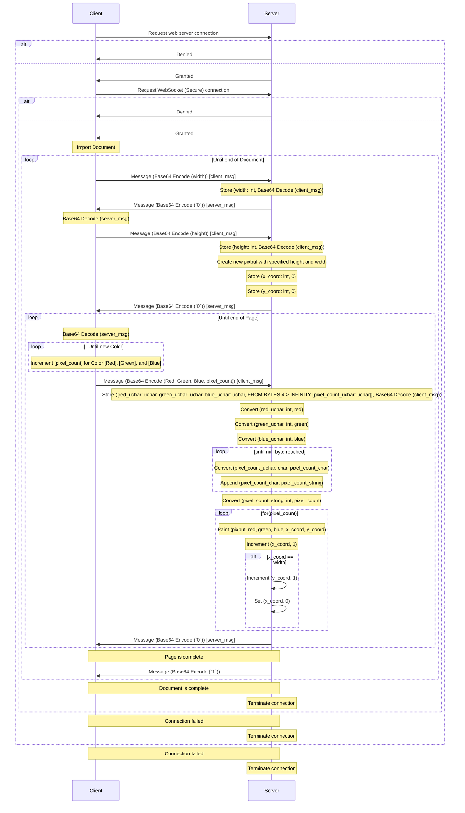

```mermaid
sequenceDiagram
	
    Client->>Server: Request web server connection
    alt
        Server->>Client: Denied
    else
        Server->>Client: Granted
        Client->>Server: Request WebSocket (Secure) connection
        alt
            Server->>Client: Denied
        else
            Server->>Client: Granted
                Note over Client: Import Document
                loop Until end of Document
                    Client->>Server: Message (Base64 Encode (width)) [client_msg]
                    Note over Server: Store (width: int, Base64 Decode (client_msg))
                    Server->>Client: Message (Base64 Encode (`0`)) [server_msg]
                    Note over Client: Base64 Decode (server_msg)
                    Client->>Server: Message (Base64 Encode (height)) [client_msg]
                    Note over Server: Store (height: int, Base64 Decode (client_msg))
                    Note over Server: Create new pixbuf with specified height and width
                    Note over Server: Store (x_coord: int, 0)
                    Note over Server: Store (y_coord: int, 0)
                    Server->>Client: Message (Base64 Encode (`0`)) [server_msg]
                    loop Until end of Page
                        Note over Client: Base64 Decode (server_msg)
                        loop- Until new Color
                            Note over Client: Increment [pixel_count] for Color [Red], [Green], and [Blue]
                        end
                        Client->>Server: Message (Base64 Encode (Red, Green, Blue, pixel_count)) [client_msg]
                        Note over Server: Store ({red_uchar: uchar, green_uchar: uchar, blue_uchar: uchar, FROM BYTES 4-> INFINITY [pixel_count_uchar: uchar]}, Base64 Decode (client_msg))
    
                        Note over Server: Convert (red_uchar, int, red)
                        Note over Server: Convert (green_uchar, int, green)
                        Note over Server: Convert (blue_uchar, int, blue)
                        loop until null byte reached
                            Note over Server: Convert (pixel_count_uchar, char, pixel_count_char)
                            Note over Server: Append (pixel_count_char, pixel_count_string)
                        end
                        Note over Server: Convert (pixel_count_string, int, pixel_count)
                        loop for(pixel_count)
                            Note over Server: Paint (pixbuf, red, green, blue, x_coord, y_coord)
                            Note over Server: Increment (x_coord, 1)
                            alt x_coord == width
                                Server->>Server: Increment (y_coord, 1)
                                Server->>Server: Set (x_coord, 0)
                            end
                        end
                        Server->>Client: Message (Base64 Encode (`0`)) [server_msg]
                    end
                    Note over Server,Client: Page is complete
                    Server->>Client: Message (Base64 Encode (`1`))
                end
                Note over Server,Client: Document is complete
                Note over Server: Terminate connection
        end
        Note over Server,Client: Connection failed
        Note over Server: Terminate connection
    end
    Note over Server,Client: Connection failed
    Note over Server: Terminate connection
```

